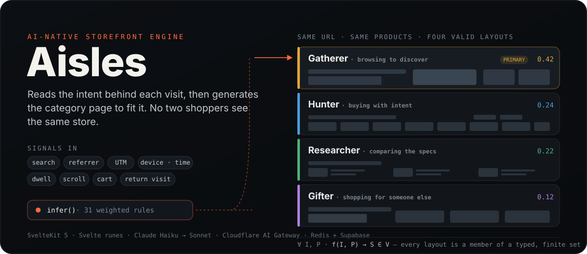

<p align="center">
  
</p>

<p align="center">
  <a href="#quickstart"><b>Quickstart</b></a> ·
  <a href="#how-it-works"><b>How it works</b></a> ·
  <a href="#the-invariant"><b>The invariant</b></a> ·
  <a href="#observe"><b>Observe</b></a> ·
  <a href="#docs"><b>Docs</b></a>
</p>

---

## What it is

Aisles is a headless storefront that decides its own layout per shopper.

Every category page is generated at request time. Aisles reads the signals behind a visit — the search that brought someone in, the referrer, the campaign tag, the device and time of day, whether they've been here before, and how they behave once they arrive — and infers which of four shopper **personas** best fits the moment. That persona drives an AI model that assembles the page from a fixed set of building blocks: which components appear, how the products are ordered, and what the copy says.

The result is a store that reorganizes itself for each visitor — **editorial for a browser, functional for a buyer** — while the operator can see exactly which signals and which rules produced it.

Four current configurations run on this single codebase. The seven Kibble subscription rules are gated to `BRAND_ID=kibble`; the other brands continue to use the original 31 rules. This is reuse inside the current generic renderer, not evidence that an unrelated merchant's reference storefront can be preserved by configuration alone.

---

## Why it's different

Most personalization swaps a widget. Aisles changes the **whole page composition** — column count, whether there's editorial copy, sort order, the call-to-action pattern — because the layout is generated, not templated.

And because it's AI-generated, the obvious risk is that the AI produces something broken. Aisles closes that risk with a correctness invariant (below): every layout the model can produce is provably a member of a small, typed set of valid layouts. That's what makes generated UI safe to ship, and what makes the whole thing explainable to a non-engineer.

| | Typical rule-based personalization | Aisles |
|---|---|---|
| Unit of change | A widget or product slot | The entire page layout |
| How intent is set | Hand-written `if` rules | 38 weighted rules → a probability across 4 personas |
| Cold start | Static default | Gatherer-biased prior that self-corrects as signals arrive |
| Safety | Trusts the template | Every AI layout validated against a typed schema, with fallbacks |
| Explainability | Opaque | Every firing rule and probability shift visible in Observe |

---

## How it works

Every category page load runs the same three stages.

```
  Signals ─────────────▶ Inference ─────────────▶ Layout
  request + behavioral    infer() · 38 rules       AI picks from 11 section types
                          → persona vector          → validated → cached
```

**1 · Signals.** Two sources feed inference. *Request-time* signals are available on every load — search query, HTTP referrer, UTM tags, device, time of day, and a cross-session cookie (stored persona, visit count). *Behavioral* signals are emitted after load and batched to `POST /api/signals` — category and product views, dwell time, scroll depth, cart adds and removals, and refinement-chat messages.

**2 · Inference.** `src/lib/signals/inference.ts` starts from a gatherer-biased prior (`gatherer 0.375, hunter 0.25, researcher 0.25, gifter 0.125`, with category-specific variants), runs 38 weighted rules against the accumulated context, and normalizes to a probability distribution over four personas. Seven subscription rules run only for Kibble; the other brands retain the original 31-rule behavior. It reports the primary persona, a confidence gap, behavioral modifiers (`priceSensitivity`, `urgency`, `familiarity`), and whether the persona **shifted** from the stored one.

| Persona | Intent | Typical generated layout |
|---|---|---|
| **Gatherer** | Browsing to discover | `editorial-header` → `hero-product` → 2-col grid, landscape images, descriptions shown |
| **Hunter** | Buying with intent | `category-header` with sort/filter → dense 4-col grid, quick-add enabled |
| **Researcher** | Comparing the specs | `category-header` → grid with specs shown, no hero |
| **Gifter** | Shopping for someone else | `editorial-header` → `hero-product` → 3-col grid at a safe price tier |

**3 · Layout generation.** The primary persona drives `POST /api/layout` (or `/api/layout/stream` for SSE). On a cache miss, Aisles loads products from BigCommerce, merges persona-fit scores from the enrichment pipeline, sorts by fit, builds a prompt, and calls the model with a structured-output constraint. The result is cached in Redis (1-hour TTL) and logged to Postgres.

---

## The invariant

The foundation of Aisles is a single formal guarantee on every AI-generated layout:

> **For all inputs `I` and all personalization vectors `P`, the layout function `f` produces a state `S` that is a member of the set `V` of valid layouts.**
>
> **∀ I, P · f(I, P) → S ∈ V**

`V` is defined literally by the Zod schema in `src/lib/schema/layout.ts`. It currently enumerates eleven section types, with a narrower allowed subset for each persona, plus their prop ranges and composition rules:

`editorial-header` · `hero-product` · `product-grid` · `category-header` · `editorial-hero` · `lifestyle-price-hero` · `image-gallery` · `product-carousel` · `category-tile-grid` · `service-callouts-grid` · `cluster-chip-row`

The invariant is enforced in three layers:

1. **Schema as definition of V** — the Zod schema is the single source of truth for what a valid layout is.
2. **Structured output** — the schema is passed to the model as a generation constraint, so output is schema-compliant by construction.
3. **Fallback cascade** — Claude Haiku → Claude Sonnet → a static Svelte layout, so a valid `S` always exists even under model failure.

The AI chooses components, orders products, and writes copy. It **cannot invent a component that isn't in the vocabulary.** That constraint is why the [Observe](#observe) dashboard can explain any page — and why generated layouts hold up in production rather than only in a demo. See [`docs/decisions/004-vocabulary-constraint-invariant.md`](docs/decisions/004-vocabulary-constraint-invariant.md).

---

## Four current configurations, one codebase

Aisles carries four configurations across several retail domains. They share the inference engine, component vocabulary, and prompt pipeline while selecting catalog and visual inputs at runtime. `src/lib/brand/config.ts` configures the current generic renderer; it is not a complete external-merchant onboarding contract or a substitute for merchant-native components and page recipes.

Related-brand reuse inside one integrated merchant organization is a separate case from preserving an unrelated merchant's existing reference storefront. The repository now has a contract-bound Kibble Preserve path for Home, product listing, search, and error surfaces. Product detail is a development-review route only. Cart, account, subscriptions, and the three canonical checkout phase routes use source-native unavailable shells: they preserve the source route anatomy without claiming live commerce, account, subscription, or checkout behavior. The bare `/checkout` path remains the canonical source's 404.

The Kibble contract resolves authority at organization, brand, route, surface, and zone. It records all 28 zone families as 36 exact expanded Bealls identities. Eleven identities have content-backed Kibble-native adapters; the other 25 are explicitly Trusted Hidden. The local parity runner covers 15 routes at 390px, 768px, and 1280px. The latest strict run still leaves every route open: all 45 viewport cells differ at zero tolerance, with 12,313,565 of 66,597,260 comparable pixels changed and no masks. The ledger identifies a truthful, named approval item for every route instead of hiding those differences. This is contract, anatomy, and mechanical screenshot evidence—not approved visual parity or functional commerce. Route-by-route human visual approval, PDP publication approval, runtime policy writes and audit storage, migration/deploy/live database-provider verification, and external-reference contracts for the Bealls family remain open. See the [organization, brand, and composition autonomy plan](docs/organization-brand-autonomy-plan.md) and the [Kibble boundary retrospective](docs/retrospective-kibble-reference-boundary.md).

| Brand | Domain | Voice |
|---|---|---|
| **Haven** | DTC home furniture | Warm, editorial, lifestyle-led |
| **Volt** | Consumer audio & electronics | Technical, spec-forward |
| **Ember** | Outdoor lifestyle & fire | Rugged, seasonal, activity-fit |
| **Kibble** | Pet supplies & Auto-Refill | Plain, warm, specific |

Each deployed brand uses a separate Cloudflare Pages project from the same repository, selected by a `BRAND_ID` environment variable.

---

## Quickstart

**Prerequisites:** Node 20+ and npm. A BigCommerce Storefront token and an Anthropic API key are enough for ordinary catalog pages. Postgres is required for generated layouts, enrichment, and operational telemetry; use `DATABASE_URL` locally and Hyperdrive in Cloudflare.

```bash
git clone https://github.com/nino-chavez/aisles.git
cd aisles
npm install

cp .env.example .env.local   # fill in BIGCOMMERCE_* and ANTHROPIC_API_KEY

npm run dev                   # http://localhost:5173
```

Open a category and append `?dev=true` to watch the engine work — a persona badge with its confidence score, the AI's layout reasoning, and shift detection:

```
http://localhost:5173/category/living-room?dev=true
```

Switch brands locally by setting both variables (requires the matching BigCommerce channel token):

```bash
VITE_BRAND_ID=volt BRAND_ID=volt npm run dev
```

Full environment reference and the enrichment/cache-warming scripts are in [`docs/development.md`](docs/development.md).

To inspect the Kibble Preserve decision without live catalog, database, Redis,
or model connections, run the isolated synthetic showcase:

```bash
npm run dev:kibble-showcase
```

Then open `http://127.0.0.1:5174/?dev=true&intent=gatherer`. The inspector shows
the inferred persona, the fixed and rules-owned zones, the product order before
and after the decision, and zero model calls. Its catalog and fit scores are
synthetic demo data, not merchant data. See
[`docs/kibble-local-showcase.md`](docs/kibble-local-showcase.md) for the exact
evidence boundary and the four deterministic scenarios.

---

## Observe

`/observe` is the operator's window into the engine. It is protected in deployed environments with HTTP Basic authentication backed by the server-side `OBSERVE_ACCESS_TOKEN` secret. It shows, per session, the live signal timeline, the persona probability vector as it updates, every inference rule that fired with its weight and human-readable reason, and the generation log (model, tokens, cost) for each layout. Kibble demo scenarios are visibly labeled synthetic and excluded from fitting and calibration.

This is the other half of the product's design principle: **invisible to the shopper, transparent to the operator.** A merchandiser, brand manager, or growth lead can see *why* the store behaved the way it did without opening the codebase.

---

## Stack

| Layer | Technology |
|---|---|
| Framework | SvelteKit 2 / Svelte 5 (runes) |
| Language | TypeScript 5 (strict) |
| Styling | Tailwind CSS v4 |
| AI SDK | Vercel AI SDK v6 + Cloudflare AI Gateway |
| Models | Claude Haiku (primary) → Claude Sonnet (fallback) |
| Layout cache + sessions | Upstash Redis |
| Enrichment + generation logs | Supabase Postgres via Cloudflare Hyperdrive |
| Catalog | BigCommerce Storefront GraphQL |
| Embeddings | OpenRouter (`text-embedding-3-small`) |
| Deployment | Cloudflare Pages (`adapter-cloudflare`) |

---

## Project layout

```
src/lib/schema/layout.ts        The invariant — the Zod contract between AI and renderer
src/lib/signals/inference.ts    Inference engine — 38 weighted rules → persona vector
src/lib/signals/store.ts        Session store — accumulates signals into an inference context
src/lib/brand/config.ts         Current generic-renderer brand configuration (not the only external-onboarding input)
src/lib/server/layout-prompt.ts Prompt construction from persona + catalog
src/lib/server/enrichment/      Offline pipeline — scores products for persona fit
src/routes/category/[slug]/     The AI-generated category page
src/routes/observe/             The operator dashboard
src/routes/api/                 layout, signals, refine, cart, observe endpoints
```

---

## Docs

| Document | What it covers |
|---|---|
| [`docs/architecture.md`](docs/architecture.md) | System architecture, the pipeline, and data flow |
| [`docs/product-vision.md`](docs/product-vision.md) | Mission, personas, and the streaming-platform inspiration |
| [`docs/signals-and-inference.md`](docs/signals-and-inference.md) | Full signal and rule catalog |
| [`docs/development.md`](docs/development.md) | Local setup, env reference, enrichment, cache warming, debugging |
| [`docs/multi-brand.md`](docs/multi-brand.md) | Adding and configuring a brand |
| [`docs/observe.md`](docs/observe.md) | The Observe dashboard |
| [`docs/decisions/`](docs/decisions/) | Architecture decision records |
| [`docs/specs/`](docs/specs/) | Roadmap specs — behavioral signals, incentives, admin app, layout transitions |

---

## Status

Aisles is an active prototype (`v0.0.1`, private). The signal → inference → layout pipeline, the four-persona engine, the typed-layout invariant with model fallback, multi-brand configuration, the enrichment pipeline, and the Observe dashboard are all implemented. The BigCommerce marketplace admin app and the persona-specific pacing, session-arc, and image-variant work described in `docs/specs/` are roadmap.

No open-source license is currently set; all rights reserved by the author.
