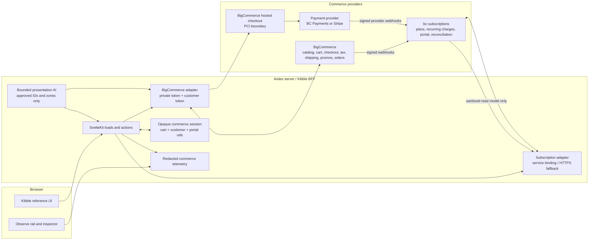

# Kibble commerce parity plan

**Status:** Phase 1 sandbox cart and hosted-checkout handoff are deployed. Phase
2 has the customer-session foundation, BigCommerce-native identity selection,
and a scoped private token. Live customer acceptance still needs an authorized
sandbox login. Phase 3 now has live provider plan reads plus a customer-gated,
idempotent cart-intent seam. The
provider still owns post-checkout subscription creation. This is not
authorization to create accounts, submit orders, charge payment instruments,
or create subscriptions during verification.

**Audience:** the engineer implementing Kibble commerce and the human who owns
the BigCommerce store, payment provider, subscription provider, and release
decision

**Source snapshot:** Aisles `origin/main` at `20f3da770279dff2689994945748724cbc004eb2`;
the Bealls-family checkout scaffold at `bealls-aisles` `0edd3ea79235953c834b00d96e6ae6b4fddf2833`;
the internal commerce reference at `bc-subscriptions` `ef122b8e17b9eb0b327c9d42491c44a61577ead4`;
authentication, login, logout, and order documentation rechecked on 2026-08-15;
other public ledger checks remain dated 2026-08-13

## Recommendation

Build Kibble commerce as a server-owned adapter seam around two existing
providers:

1. BigCommerce owns catalog, cart, checkout, taxes, shipping, promotions,
   orders, and hosted payment. It owns customer identity only if the merchant
   approves the BigCommerce-native mode.
2. `bc-subscriptions` owns Auto-Refill plans, recurring charges, subscription
   lifecycle, stored payment instruments, portal actions, and provider
   reconciliation.
3. Aisles owns the browser-facing Kibble UI, server-to-server calls, session
   binding, safe read models, error states, and redacted commerce telemetry.
4. Presentation AI may choose from already-approved catalog candidates inside
   an approved Kibble zone. It cannot set price, tax, shipping, promotion,
   payment, customer, cart, order, or subscription state.

The first production-shaped slice is one-time purchase only:

```text
Kibble PDP
  -> server add-to-cart
  -> persistent BigCommerce cart
  -> Kibble cart page/drawer
  -> server-created BigCommerce hosted-checkout redirect
```

Do not start with a custom card form, a local order table, or an Aisles-owned
subscription engine. The reference implementation already solves the hard
provider seams, and BigCommerce explicitly separates payment processing from
the GraphQL Storefront API.

## What is implemented

The deployed production configuration enables the one-time sandbox cart slice.
Upstash now owns durable session, lock, rate-limit, and idempotency records.
Cloudflare still fails closed when either the BigCommerce or Redis connection is
missing.

```text
Browser
  -> opaque Kibble commerce-session cookie
  -> Aisles server
       -> durable cart reference + cart-mutation idempotency result in Redis
       -> one serialized mutation per session
       -> hashed-address and global mutation limits
       -> BigCommerce Storefront GraphQL cart + cart version
       -> one-use hosted-checkout URL only when requested
       -> optional BigCommerce customer token held only in Redis
       -> customer-token cart context after confirmed login
       -> read-only customer order adapter after confirmed login

No path
  -> customer account creation
  -> order creation
  -> payment instrument or charge
  -> subscription creation or renewal
```

The deployed working operations are add, read, update quantity, remove line,
empty cart, header item count, browser-session persistence, and hosted-checkout
handoff. The account adapter and UI remain inactive in production.
BigCommerce remains the only cart and price authority. Aisles stores only the
opaque browser session, its server-side cart reference, cart replay result, and
redacted attempted/confirmed evidence. Presentation AI receives no mutation
authority and every commerce response reports zero model calls.

The deployed anonymous cart still uses the existing Storefront bearer token and
opaque cart entity ID without replaying a BigCommerce shopper cookie. That is a
migration bridge, not the target credential. BigCommerce now deprecates
Storefront tokens for server-to-server requests. New customer calls require a
private token, and authenticated cart calls add the server-held
`X-Bc-Customer-Access-Token`. The anonymous cart transport must also move to a
private token before existing originless Storefront tokens stop being accepted
on March 31, 2027. The Bealls visitor-cookie cache belongs to BigCommerce's
separate stateful request mode and is still intentionally not copied.

The server requires an idempotency key for each mutation. It atomically reserves
the key, serializes mutations by commerce session, sends the current
`Cart.version` on supported line mutations, and replays terminal cart results.
Checkout is the deliberate exception: the server serializes the request but
never caches or replays BigCommerce's single-use URL. A repeat request validates
the cart and mints a new just-in-time handoff. Anonymous mutation traffic is
also bounded per one-way-hashed client address and globally before a session or
provider cart can be created.
Mutation routes also reject requests without same-origin `Origin` or `Referer`
evidence before reading the cart session.
It does not retry an ambiguous provider outcome. A later read is the recovery
path. A confirmed missing cart is cleared before the shopper can create another
one.

The current shopper limitation is explicit: the one-time add button is enabled
only for in-stock products without options. Variant and option selection remains
disabled until the merchant confirms the Kibble product model. Auto-Refill stays
display-only.

Verified 2026-08-14 against BigCommerce’s current
[GraphQL cart and checkout guide](https://docs.bigcommerce.com/developer/docs/admin/checkout-and-cart/custom-checkouts/graphql-storefront)
and [checkout redirect example](https://docs.bigcommerce.com/developer/learn/courses/graphql-storefront-api/checkout/lab-query-practice).

### Deployed sandbox verification on 2026-08-15

The real Kibble sandbox confirmed create/add, read after navigation, quantity
update, line removal, full-cart deletion, header count, and hosted-checkout
handoff. Provider cart versions advanced with confirmed mutations. Reusing one
idempotency key returned the stored result without advancing the cart again. Two
simultaneous first mutation requests for one established session produced one
confirmed result and one local `operation_in_progress` response. Cookie-less
mutations are rejected; SSR establishes the opaque session before the first
shopper action. The hosted handoff resolved to the configured
HTTPS Kibble checkout host; the proof did not follow the URL or submit checkout.
The final proof operation deleted the sandbox cart.

Upstash returned `PONG` before release. The deployed smoke test then confirmed
reload persistence, terminal idempotency replay, one-success/one-blocked
concurrency, empty-and-recreate recovery, rendered cart controls, and one
HTTPS hosted-checkout handoff that was not opened. The final operation deleted
the test cart. PRs [#26](https://github.com/nino-chavez/aisles/pull/26) and
[#27](https://github.com/nino-chavez/aisles/pull/27) are merged. Cloudflare
deployment `3d906469-696d-49c8-95fb-a5a11b90fb16` serves merge commit
`a0e03be5c31bf8ce7ba6dd90ec5ee9fb990dd656`.

## What existed before this branch

The `origin/main` baseline is a catalog and presentation system with an honest
commerce boundary. It is not a partial transaction system that can be enabled
by removing one flag.

```text
Current

Browser
  -> Kibble Preserve routes and native reference components
       -> BigCommerce GraphQL catalog reads
       -> Aisles signals / inference / bounded presentation AI
       -> cart, account, checkout, subscription unavailable shells

Generic non-Kibble path
  -> /api/cart -> simple BigCommerce cart mutations
  -> /checkout -> hand-built checkout-domain URL
  -> cookie-based incentives payload
  -> no customer access-token context
```

The relevant evidence is in:

| Surface | Current implementation | Consequence |
|---|---|---|
| Catalog | `src/lib/server/bigcommerce.ts` reads products, categories, options, inventory, and related products through GraphQL. | This is the reusable starting point. |
| Cart adapter | The same file can create, add to, and read a simple cart. Its line shape omits variants/options, cart totals, shipping, tax, and customer context. | It cannot support reference-parity cart behavior as written. |
| Kibble cart API | `src/routes/api/cart/+server.ts` returns `503` for Kibble. | No Kibble cart is read, created, priced, or changed today. |
| Kibble cart page | `src/routes/cart/+page.server.ts` and `KibbleCartReference.svelte` render the unavailable source-native shell. | The shell is useful UI evidence, not transaction evidence. |
| Checkout | Bare `/checkout` is intentionally a Kibble `404`; `/checkout/gift`, `/checkout/prepaid`, and `/checkout/confirmation` are unavailable presentation routes. | The current Kibble route contract must change only behind a commerce flag. |
| Generic checkout | `src/routes/checkout/+page.svelte` loads a client-side cart and constructs a `mybigcommerce.com/checkout?cartId=...` URL. | Replace this with a server-side `cart.createCartRedirectUrls` call. |
| Account | Account route handlers accept login, register, orders, addresses, payment methods, subscriptions, and logout paths but make no customer-provider calls. | There is no customer identity or account data path. |
| Subscriptions | `src/routes/subscriptions/+page.server.ts` and `src/routes/portal/subscriptions/[id]/+page.server.ts` return unavailable state. | There is no plan lookup, portal session, charge, or lifecycle mutation. |
| Session | `aisles_session` is a 30-day signal cookie with a 30-minute Redis-backed signal store. It has organization/brand scoping but no customer or cart authority. | Keep it separate from commerce identity. |
| Observe | Observe and the bounded Kibble model actions trace inference and approved presentation permutations. | They must remain non-authoritative for commerce. |
| Configuration | `.env.example` has BigCommerce catalog credentials, AI, database, Observe, and Voucherify entries. It has no subscription-provider configuration. | Provider readiness is an explicit prerequisite. |

The Aisles server uses its existing BigCommerce Storefront bearer token. It is
never serialized into HTML or returned to the browser. Customer access-token
context is a later account-phase decision. See [GraphQL Storefront
authentication](https://docs.bigcommerce.com/developer/docs/storefront/guides/graphql-storefront-api/authentication).

### Catalog capability projection

The preserve storefront now carries a pinned, display-safe capability
projection alongside the live BigCommerce product read. The projection covers
all 49 sandbox catalog rows. A generated offer snapshot contains 34 Auto-Refill
rows, while the canonical storefront registry verified one day earlier lists
10 products. Those are separate evidence classes, not one current eligibility
claim. Home and category cards may render the hash-pinned Auto-Refill price,
cadence, and savings when the current effective catalog price still supports
the stated percentage. PDPs may additionally show trial, intro-offer, and
annual evidence. Prepaid, gift, and build-a-box remain explicitly portal-owned
and never appear as product capabilities. The offer file is undated, so the UI
does not borrow the separate demo-state timestamp as an offer date.

This projection makes the storefront demonstrable without pretending that a
card label is a transaction. BigCommerce remains the live catalog and price
authority; `bc-subscriptions` remains the plan and lifecycle authority. The
projection must be replaced by a server-side plan lookup before any purchase
mode, cart intent, or checkout action is enabled.

### Merchant capability manifest and demo completeness

The 1.10.0 presentation contract makes the catalog useful to both shoppers and the
bounded presentation runtime. It does not add more marketing claims to the
brand theme. It adds a separate merchant capability manifest with explicit
provenance and ownership:

```text
BrandConfig
  -> brand expression, navigation, and visual language

Kibble merchant capability manifest
  -> 49 catalog identities
       -> consumable, durable, or bundle role
       -> pinned offer projection and canonical-registry status
       -> category shopper job and comparison dimensions
       -> merchant-supported cadence options when the source supports them
  -> seven capabilities reported live in the 2026-06-29 source snapshot
       -> one local read-only review path each
  -> seven configurable source models outside current Kibble intent
       -> explicit not-claimed reason; no invented demo path
  -> six enabled Kibble Aisles presentation capabilities
	   -> fourteen typed action-by-surface proofs across Home, PLP, PDP, Search, Cart, and Checkout
	   -> each proof names a stable route, exact instances, prerequisites, counts, and fail-closed result
	   -> action types remain separate from named rendered zone instances

Provider services
  -> cart, account, order, payment, plan, and subscription state
```

Category context is merchant-authored and category-specific. Dog food is
compared by protein, life stage, food format, diet needs, and replenishment.
Toys are compared by play style, size, durability, and supervision. A durable
toy is therefore not treated as a weak Auto-Refill candidate merely because a
global shopper persona favors repeat purchase. This folds in the Work Library
finding that behavioral signals can invert across retail categories without
turning the inference taxonomy into the product's differentiator.

The manifest keeps the source records separate. The canonical storefront
registry verified on 2026-06-28 lists 10 products and three PDP capabilities.
A generated offer file contains 34 product rows. The broader demo-state,
captured on 2026-06-29, names seven live capabilities: four storefront-facing
and three portal-facing. The marketing registry also names seven configurable
models that the Kibble demo does not claim: bundle plans, membership, metered
usage, curation, allotment, multi-actor, and calendar-anchored billing.
One source contradiction remains visible instead of being averaged away: the
June 28 canonical registry calls gift absent because no `gift_tokens` table
exists, while the June 29 demo-state reports one live gift portal scenario.
That is evidence of source drift, not proof that gift is currently available.
Aisles exposes the four storefront capabilities as catalog/PDP evidence and
the three portal capabilities as fixed service-boundary previews. It does not
claim that the Aisles storefront completed the source service's flow. The
capability manifest never emits product links. It uses local evidence anchors;
only ordinary catalog surfaces may emit PDP links through the existing
publication and live-product gates.

Acceptance for this slice is mechanical:

- every one of the 49 catalog IDs resolves to exactly one category job and
  product role;
- every live-in-snapshot Kibble capability resolves to a local review path;
- every configurable source model outside current Kibble intent carries an
  explicit not-claimed reason;
- pinned offer evidence is suppressed when the live BigCommerce effective price no
  longer supports the pinned savings arithmetic;
- every enabled action-and-surface pair resolves to its own Observe-ready proof
  with candidate prerequisites, Before, changed and kept outcomes, expected
  counts, fixed facts, and a fail-closed reason in
  `KIBBLE_AISLES_CAPABILITY_DEMOS`;
- eligibility never increments AI-zone or AI-call counts; only rendered
  model-selected output and actual provider attempts do;
- `generate_bounded_copy` and `select_page_recipe` remain absent because the
  current Kibble policy does not enable them;
- no manifest record carries a cart intent, plan ID, payment value, customer
  identity, or transaction authorization; and
- Observe labels merchant outcome proof as not measured. Capability coverage
  is not conversion or revenue evidence.

## Reference behavior and internal patterns

### The Bealls-family Aisles path is a scaffold, not the commerce authority

The current `bealls-aisles` checkout path is the useful family reference for
the handoff shape:

- `src/routes/api/cart/+server.ts` creates, adds, updates, and deletes cart
  lines through BigCommerce.
- `src/lib/server/cart-store.ts` stores the BigCommerce cart response and the
  BigCommerce visitor session cookie in Redis so later requests can replay the
  same cart context across instances.
- `src/routes/checkout/+page.server.ts` renders a handoff page and calls
  `getCheckoutRedirectUrl`.
- `getCheckoutRedirectUrl` uses GraphQL
  `cart.createCartRedirectUrls` and renders a button to BigCommerce hosted
  checkout.
- `src/routes/account/+page.server.ts` is still a mock dashboard with fake
  customer, order, loyalty, and recommendation data. It is not a customer
  authentication or order-history implementation.

This is the correct family-level direction for cart and checkout presentation,
but it is not sufficient for Kibble. Its Redis cart cache also preserves a
BigCommerce visitor session cookie. That behavior must be re-derived against
the Kibble channel and the customer-token flow before reuse.

### The canonical transaction reference is `bc-subscriptions`

The internal reference at `bc-subscriptions` contains the complete transaction
shape that Kibble needs:

| Flow | Reference behavior | Source of truth |
|---|---|---|
| Cart | Full cart query, physical lines, selected options, currency/amounts, update/remove, checkout redirect. | `apps/storefront-svelte/src/lib/server/cart.ts` |
| Customer login | Server-side BigCommerce GraphQL `login`, optional `guestCartEntityId`, customer access token, returned cart, server-only session. | `apps/storefront-svelte/src/lib/server/customer-auth.ts` |
| Customer orders | Server-side `customer.orders` query with `X-Bc-Customer-Access-Token`. | `apps/storefront-svelte/src/lib/server/customer-orders.ts` |
| Checkout | Server calls `cart.createCartRedirectUrls`; BigCommerce hosted checkout receives cart and customer context. | `apps/storefront-svelte/src/lib/server/cart.ts` |
| One-time / subscription cart intent | Server-to-server call to `POST /api/v1/storefront/cart/:cartId/intents?store_hash=...`; subscription plan is resolved by the subscription service. | `apps/storefront-svelte/src/lib/server/cart-intents.ts` |
| Auto-Refill portal | Portal session and API client cover list, skip, swap, pause, resume, cancel, cadence, quantity, addresses, payment methods, upcoming charges, and preferences. | `apps/storefront-svelte/src/lib/subscriptions/api-client.ts`, `SubscriberPortalApp.svelte` |
| Gift / prepaid | Server-side validation, deterministic idempotency key, provider-specific charge ordering, subscription creation, and confirmation state. | `apps/api/src/routes/storefront/checkout/gift.ts`, `prepaid.ts` |
| BigCommerce webhook | Signed order event is reconciled to cart metafield intent, then a subscription is materialized idempotently. | `apps/api/src/routes/webhooks.ts` |
| Payment provider | BC Payments uses order-first because it requires an incomplete BigCommerce order; Stripe uses charge-first. | `apps/api/src/adapters/bc-payments.ts`, `stripe.ts`, `order-first-sequencer.ts` |

The public [reference storefront](https://storefront.bcsubs.app/) was read with
anonymous, read-only GETs on 2026-08-13; those reads returned:

- `/cart`: an anonymous empty-cart state with “Start shopping”;
- `/checkout/gift`: delivery count, recipient email, and magic-link sign-in
  before the purchase action;
- `/checkout/prepaid`: delivery count and magic-link sign-in before purchase;
- `/account/login`: password and magic-link choices;
- `/account/orders` and `/account/subscriptions`: sign-in redirect for an
  anonymous visitor;
- `/portal/subscriptions/demo`: a portal detail route that is not a valid
  authenticated subscription proof by itself.

These reads establish rendered reference behavior. They do not prove a live
payment, subscription, or account mutation, and none was run for this plan.

The reference source also contains a critical negative finding: arbitrary cart
line custom fields are not a reliable subscription-intent channel. The
reference keeps a confirmed-empty fallback in
`apps/api/src/services/subscription-materializer.ts`. Use the cart metafield
contract and the subscription service intent endpoint instead.

## Target architecture



The key boundary is that the browser never receives BigCommerce private or
customer access tokens, payment credentials, subscription-provider secrets, or
raw provider webhook payloads. It receives display-safe data and one-time
checkout redirect URLs.

## Ownership boundaries

| Capability | Owning system | Aisles may do | Aisles must not do |
|---|---|---|---|
| Product identity, SKU, price, stock | BigCommerce | Read and display a server-fetched snapshot. | Invent price/stock or trust browser-submitted price. |
| Cart lines and totals | BigCommerce | Request create/add/update/remove and render returned totals. | Store a competing authoritative cart or calculate tax/discount totals locally. |
| Checkout session | BigCommerce | Mint a redirect URL server-side and show a handoff/error page. | Construct a guessed checkout URL or reuse a single-use URL. |
| Tax and shipping | BigCommerce plus configured merchant providers | Display provider-returned values when available. | Promise tax/shipping values from Aisles copy or AI. |
| Promotions | BigCommerce promotion configuration; a separate approved service only if the merchant chooses one | Submit a code and display the provider result. | Treat current Voucherify/local evaluator output as a discount on a real order. |
| Payment entry and authorization | BigCommerce hosted checkout or the configured payment provider | Receive safe status and provider reference identifiers server-side. | Receive PAN, CVV, raw bank data, or process a card in Aisles. |
| Customer identity | BigCommerce customer account | Authenticate server-side, set an opaque httpOnly session, and show safe profile fields. | Use `aisles_session` as identity or expose customer access tokens to JavaScript. |
| Subscription plan and lifecycle | `bc-subscriptions` | Proxy plan reads and portal actions after ownership checks. | Reimplement recurring billing, dunning, or stored-card state in Aisles. |
| Order history | BigCommerce customer order query | Render authenticated order summaries. | Use fake/mock order rows in a live mode. |
| Webhook reconciliation | `bc-subscriptions` service and its durable store | Forward only if the service contract requires it; display reconciliation state. | Mark an order or subscription paid because a browser returned to a page. |
| Sessions and correlation | Aisles for commerce-session binding; providers for provider sessions | Join opaque session IDs, cart IDs, and safe status. | Merge signal sessions, customer sessions, and provider credentials into one cookie. |
| Presentation personalization | Aisles bounded AI and deterministic policy | Reorder approved product IDs within a named zone and log before/after order. | Change provider state, price, eligibility, plan, payment, or checkout totals. |

## Parity matrix

“Verified” below means re-derived from the pinned source or a direct read of an
official source. It does not mean the Kibble implementation is complete.

| Surface | Reference behavior | Current Aisles state | Target implementation and proof |
|---|---|---|---|
| Cart | Anonymous cart can be empty; authenticated and guest carts are read through the same server cart adapter; line quantity/removal and totals are visible. | Deployed sandbox read/add/update/remove/empty, provider totals, cart versioning, durable persistence, and controlled recovery are verified. | Add customer context and guest-cart merge only with account authorization. |
| PDP purchase | Reference product flow supports one-time purchase and Auto-Refill intent with a cadence and saved plan mapping. | An in-stock optionless product can use the real one-time sandbox cart. Options remain disabled, and Auto-Refill remains display-only. | Resolve merchant-approved variants/options server-side. Add Auto-Refill only after plan lookup and intent confirmation. |
| Checkout | Ordinary cart checkout is BigCommerce hosted. Gift and prepaid are separate subscription-service flows with sign-in and stored payment method behavior. | The deployed cart mints `createCartRedirectUrls` only on handoff. The proof did not follow or submit checkout. Bare `/checkout` remains 404; gift/prepaid name their identity, plan, and payment-adapter gates. | Keep gift/prepaid separate and provider-backed; do not submit an order or payment without explicit authorization. |
| Account and identity | Password login and magic-link sign-in are both represented. Login can merge a guest cart. Private account routes gate on customer session. | Account routes state `merchant_decision_required`, render disabled forms, and make no customer request. `aisles_session` remains a signal session, not identity. | Choose BigCommerce-native or subscription-service identity ownership. Then add server form actions and an opaque httpOnly customer session; never put provider tokens in page data. |
| Orders | Authenticated account shows BigCommerce customer order summaries. | Kibble exposes no order-creation endpoint or mock order rows. Order history states `customer_session_required`. | Query `customer.orders` server-side with customer access token. Label the result empty, unavailable, or live from provider state. Test customer ownership and no cross-account leakage. |
| Auto-Refill plan selection | Product can expose one-time versus subscription mode, cadence, subscribe price, savings, and next-charge preview. | Kibble card “Auto-Refill” data is presentational only; no plan request or cart intent. | `GET /api/subscriptions/plans?bc_product_id=` through Aisles to the subscription service. Resolve plan server-side. Store intent through `/api/v1/storefront/cart/:cartId/intents`; expose confirmed/failed state. Never use line custom fields. |
| Subscription creation | Subscription is materialized after the relevant order flow and reconciled by signed webhooks. | No provider integration or subscriber state exists. | Subscription service owns materialization, cycle ledger, provider charge, dunning, and webhook retry. Aisles displays only service responses. Test duplicate delivery and timeout-before-response. |
| Subscription portal | List, detail, skip, swap, pause, resume, cancel, cadence, quantity, addresses, payment method, upcoming charges, and preferences are represented in the reference portal. | Kibble states `provider_not_connected` and `portal_session_required`; no identifier triggers a provider read. | Proxy the existing subscription service API with a same-origin route or service binding. Require portal session and customer ownership on every action. Test every action against provider mocks before sandbox. |
| Gift / prepaid | Gift validates plan, cycles, recipient, and stored instrument. Prepaid charges upfront and creates an active subscription with a prepaid extension. | Disabled inputs and no plan or total. | Reuse reference checkout contracts. BC Payments uses order-first; Stripe uses charge-first. Idempotency keys are deterministic and scoped to customer/plan/cycles/payment instrument/recipient. |
| Taxes | Checkout provider computes taxes in the checkout context. | Provider cart totals are live; Aisles does not calculate or present a separate tax estimate before hosted checkout. | Aisles displays only BigCommerce checkout/cart values. Tax jurisdiction and exemption decisions remain merchant/provider decisions. |
| Shipping | BigCommerce checkout calculates available methods and shipping cost. | Hosted checkout owns shipping; Aisles does not expose a shipping-method API. | Use BigCommerce checkout shipping APIs only if building an embedded checkout is approved; otherwise hosted checkout owns it. Never show “free shipping” unless the merchant config and provider response support it. |
| Promotions | Reference checkout/provider owns discount and subscription pricing; plan discount is merchant-declared. | Generic local/Voucherify evaluator produces UI incentives but Kibble cart is disabled. | Choose one real promotion authority. For the first slice, omit promotion mutation or pass code to BigCommerce and display its result. Do not connect the local evaluator to order totals without a contract. |
| Payments and PCI | Reference adapters distinguish BC Payments order-first from Stripe charge-first; hosted checkout keeps card entry outside the storefront server. | No Kibble payment path. Generic checkout does not prove a PCI-safe implementation. | First slice uses hosted checkout only. Later stored instruments remain in the provider/service boundary. Aisles handles tokens/last4 only where the provider contract requires it. |
| Sessions and identity | Reference passes customer token server-to-server, uses a session cookie, and passes guest cart ID during login. | Aisles has signal session and cart cookie only; generic cart does not accept customer token. | Keep `aisles_session`, `bc_cart_id`, and `commerce_session` separate. Bind the cart to the provider customer context and rotate/clear on logout. |
| Webhooks | BigCommerce emits order-created even for incomplete orders; transaction/status/refund events are separate. The service verifies signatures and reconciles idempotently. | No provider webhook receiver in Aisles; signal route accepts typed browser events. | `bc-subscriptions` receives BigCommerce and payment-provider webhooks. Verify Standard Webhooks signature and timestamp, persist event ID/order ID dedupe, fetch canonical order/cart data, and retry safely. |
| Error recovery | Reference has provider-specific decline handling, idempotency, retries, portal edge-state actions, and a subscription materializer fallback. | Generic cart recreates on add failure and generic checkout swallows some failures; Kibble only shows unavailable. | Define typed errors and a recovery UI. Never retry a payment blindly after a timeout. Query provider state or wait for webhook before retry. |

## Proposed APIs and data contracts

These are Aisles BFF contracts. They are not public BigCommerce or
`bc-subscriptions` contracts. The implementation should use schemas and
provider adapters so provider response changes do not leak into Kibble UI.

### Cart and checkout

```ts
type CommerceCartLine = {
  lineId: string;
  productEntityId: number;
  variantEntityId: number | null;
  name: string;
  sku: string | null;
  selectedOptions: Array<{ name: string; value: string }>;
  quantity: number;
  unitPrice: Money;
  extendedPrice: Money;
  imageUrl: string | null;
  isMutable: boolean;
  subscriptionPlan: SubscriptionPlanSummary | null;
};

type CommerceCart = {
  cartEntityId: string;
  currencyCode: string;
  lines: CommerceCartLine[];
  subtotal: Money;
  discountedTotal: Money | null;
  amount: Money;
  providerState: 'fresh' | 'recovered';
};

type Money = { value: number; currencyCode: string };

type AddCartRequest = {
  productEntityId: number;
  variantEntityId?: number;
  optionSelections?: Array<{ optionEntityId: number; optionValueEntityId: number }>;
  quantity: number;
  purchaseMode: 'one-time' | 'auto-refill';
  planId?: string;
};
```

Recommended same-origin operations:

```text
GET    /api/cart
POST   /api/cart                 { AddCartRequest }
PATCH  /api/cart/lines/:lineId   { quantity }
DELETE /api/cart/lines/:lineId
POST   /api/cart/promotions      { code }
DELETE /api/cart/promotions/:code
POST   /api/checkout/redirect    -> { redirectedCheckoutUrl }
```

Every mutating operation accepts an opaque idempotency key. The browser reuses
that key when retrying the same user action; the server scopes it to the
commerce session and action, then records cart-mutation results. Checkout uses
the key only for request coordination because its single-use URL cannot be
replayed safely. The server
validates the product/variant/option tuple against BigCommerce and ignores
client prices.

`POST /api/checkout/redirect` calls the GraphQL
`cart.createCartRedirectUrls` mutation with the current cart entity ID. The
deployed anonymous path has no customer access token. The inactive authenticated
path now adds the server-held customer token before minting the same handoff.
BigCommerce documents both redirect URL forms
and the GraphQL cart capability in [Carts and
Checkout](https://docs.bigcommerce.com/developer/docs/admin/checkout-and-cart/custom-checkouts/graphql-storefront).
The URL is a handoff artifact, not a long-lived API credential. Generate it
only when the shopper clicks checkout and never cache it in HTML or Redis.

### Account and subscription boundary

```text
GET    /api/account/session
POST   /api/account/session   { email, password }
DELETE /api/account/session
GET    /api/account/orders
NO ROUTE: account registration, password reset, or magic link
GET  /api/subscriptions/plans?bc_product_id=<id>
POST /api/cart/:cartId/intents { cartLineId, planId, cycles? }
GET  /api/portal/session
GET  /api/portal/subscriptions
POST /api/portal/subscriptions/:id/{skip,swap,pause,resume,cancel,...}
```

When identity is enabled, the account routes call BigCommerce GraphQL. The
subscription and portal routes
proxy the existing service API through a Cloudflare service binding in deployed
environments and a server-side HTTPS origin in local development. The browser
uses same-origin Aisles routes and never receives the service binding or its
credentials.

BigCommerce customer access tokens are server-to-server state and can scope
customer and order queries. See [GraphQL Storefront authentication](https://docs.bigcommerce.com/developer/docs/storefront/guides/graphql-storefront-api/authentication),
[customer registration](https://docs.bigcommerce.com/developer/docs/storefront/guides/graphql-storefront-api/customers),
and [customer orders](https://docs.bigcommerce.com/developer/docs/storefront/guides/graphql-storefront-api/orders).
BigCommerce's REST "Storefront Subscriptions" resource manages newsletter and
marketing email subscriptions; it is not the recurring Auto-Refill provider.
See [Storefront Subscriptions](https://docs.bigcommerce.com/developer/api-reference/rest/storefront/subscriptions).

### Safe response rules

- Page data may include customer display name, email, order summaries, plan
  labels, cadence, masked payment method, and safe provider status.
- Page data must not include BigCommerce private tokens, customer access tokens,
  service credentials, webhook signatures, raw payment responses, full
  addresses outside the page that needs them, or provider internal notes.
- Logs may include a request ID, operation name, outcome, latency, hashed cart
  ID, hashed customer ID, provider status code, retry count, and safe event
  type. Logs must not include email, address, card data, access tokens, or full
  webhook bodies.

## Session, cart, and identity lifecycle

```text
Anonymous visit
  1. Aisles may create `aisles_session` only for Observe/inference.
  2. Aisles sets a separate opaque Kibble commerce-session cookie.
  3. PDP add action creates or updates a BigCommerce guest cart.
  4. Redis holds the cart reference, locks, and idempotency results.

Login
  1. Server reads the Redis cart reference as an optional guest cart.
  2. Server calls BigCommerce `login(..., guestCartEntityId)`.
  3. Server stores only the customer entity ID, customer access token, and token
     expiry in the durable commerce session. It stores no profile PII.
  4. Server replaces the Redis cart reference with the returned customer cart ID.
  5. Every later cart and customer query sends the customer token server-side.

Checkout
  1. Server reads the current commerce session and cart.
  2. Server reloads the cart with customer context.
  3. Server mints a fresh `redirectedCheckoutUrl`.
  4. Browser navigates to BigCommerce hosted checkout.
  5. BigCommerce/payment provider owns checkout completion.

Logout / expiry
  1. Server calls BigCommerce logout when a provider customer session exists.
  2. Server clears the customer reference only after provider confirmation.
  3. Server adopts the anonymous cart ID returned by BigCommerce logout.
  4. An expired token is ignored and cleared on the next serialized mutation.
  5. `aisles_session` remains an anonymous signal session and is never promoted
     to a customer identity.
```

Use an opaque, server-owned commerce session ID in an
httpOnly, `SameSite=Lax`, `Secure` cookie. The internal reference stores the BC
customer access token inside a signed JWT cookie. Aisles already has Redis and
should store the provider token server-side instead, because BigCommerce says
customer access tokens are server-to-server only. This is a deliberate,
security-motivated deviation from that internal storage shape; the provider
header and login/cart flow remain canonical.

Concurrent cart mutations need a per-commerce-session coordination key. A
mutation should:

1. read the latest cart and version/updated-at marker;
2. acquire a short Redis lock for `commerce:<session>:cart`;
3. apply one provider mutation with the idempotency key;
4. write the returned cart and release the lock;
5. return a conflict if the lock or provider version is stale rather than
   silently overwriting the other tab.

If the provider does not expose a usable version marker, serialize operations
with the lock and return the provider’s latest cart after every mutation. The
browser is then the source of intent, and BigCommerce remains the source of
state.

## Subscriptions and payment sequencing

### Ordinary Auto-Refill cart

The ordinary cart does not charge a card in Aisles. It carries a subscription
intent alongside the cart through the subscription service’s existing endpoint:

```text
PDP selects plan/cadence
  -> Aisles validates product + plan
  -> BigCommerce adds the product line
  -> Aisles posts { cartLineId, planId, cycles? } to bc-subscriptions
  -> service writes its cart-intent/metafield contract
  -> cart reads intent and renders Auto-Refill summary
  -> hosted BigCommerce checkout
  -> BigCommerce order webhook
  -> bc-subscriptions reconciles order and materializes subscription
```

The intent write needs an explicit failure policy. The default recommendation is
to block a requested Auto-Refill add if the intent cannot be confirmed, then
offer “Add as one-time purchase” as a deliberate second action. A silent
one-time downgrade is unsafe because the shopper could believe a recurring
order was created.

### Gift and prepaid

These are not ordinary cart operations:

- Gift validates active plan, cycle count, recipient email, stored payment
  method, and merchant/provider eligibility. It creates a paused gift
  subscription and a claim path after a successful charge.
- Prepaid validates plan and cycles, charges the full term, creates an active
  subscription plus prepaid extension, and schedules the next renewal.
- For BC Payments, create an incomplete BigCommerce order first because the
  provider adapter requires an order context.
- For Stripe, charge first with a deterministic `Idempotency-Key`, then create
  the subscription/order record.

When implementing these flows, keep the adapter split from
`apps/api/src/adapters/bc-payments.ts` and `stripe.ts`. Do not call a guessed
`POST /v3/orders` endpoint. BigCommerce documents `POST /v3/checkouts/{checkoutId}/orders`
for the headless checkout order path and the Admin Management API documents
`POST /v2/orders` for the separate admin order-creation path. Pick the flow
based on the provider adapter, not on a shared “create order” helper. See
[Handling Orders](https://docs.bigcommerce.com/developer/docs/storefront/headless/orders)
and [Create an order](https://docs.bigcommerce.com/developer/api-reference/rest/admin/management/orders/create-order).

## Webhooks and reconciliation

`bc-subscriptions` should own the durable webhook receiver and reconciliation
state. Aisles should not infer payment success from a redirect, client event, or
return URL.

BigCommerce’s current event reference says `store/order/created` can fire for
incomplete orders, failed payment, and payment-not-processed orders. It also
separates status, transaction, and refund events. See [Webhook
Events](https://docs.bigcommerce.com/developer/docs/integrations/webhooks/event-reference/events).

Required receiver behavior:

1. Verify the Standard Webhooks signature and timestamp before parsing business
   data. BigCommerce’s [HTTP Webhooks security
   guidance](https://docs.bigcommerce.com/developer/docs/beta/webhooks/http-webhooks)
   recommends validating both.
2. Reject an unknown producer/store hash and a timestamp outside the replay
   window.
3. Persist `(provider, store_hash, event_id)` before dispatching, with a unique
   constraint. A duplicate returns success after the prior result is known.
4. For order-created, fetch canonical order/cart data server-side. Do not trust
   the small webhook payload as the complete order.
5. Read subscription intent through the service-owned cart metafield contract.
   Treat absent, malformed, or conflicting intent as a reconciliation exception,
   not as permission to guess.
6. Materialize cycle zero once. Anchor idempotency on order ID plus intent and
   provider transaction where available.
7. Process transaction, status, refund, and payment-provider events into the
   subscription ledger. A failed or delayed event remains retryable.
8. Expose sanitized reconciliation status to Aisles for account/portal copy.

The Aisles webhook surface, if required for routing, should be a thin verified
forwarder with no business-state mutation. It must not write `commerce.add_to_cart`
from a webhook or present a subscription as active before the service confirms
it.

## Error and recovery contract

| Failure | Browser result | Server recovery |
|---|---|---|
| Product or option is invalid | “This item changed. Refresh and try again.” | Re-read product/options from BigCommerce; do not retry blindly. |
| Cart ID expired or belongs to another customer | Reset the cart view and keep the shopper on Kibble. | Delete stale cart cookie; create a new cart only from the current validated request. |
| Two tabs mutate the cart | Show the latest cart and a non-destructive “Cart updated” notice. | Serialize or return conflict; never overwrite a newer provider response. |
| Checkout redirect fails | Show “Checkout is temporarily unavailable” with “Refresh cart.” | Re-read cart, mint a new URL; never reuse a redirect URL. |
| Payment/checkout times out | Show “We are checking your order.” | Query provider/order state or wait for webhook before allowing retry. Use idempotency. |
| Payment declines | Show provider-safe decline copy and a next action. | Do not retry non-retryable declines; provider/service owns dunning. |
| Subscription intent write fails | Do not claim Auto-Refill. Offer one-time add as a separate action. | Retry safe intent call; record failure and surface an operator alert. |
| Webhook signature fails | No shopper-visible change. | Return non-success, log safe reason, and alert after threshold. |
| Webhook arrives twice/out of order | Keep current status until reconciliation completes. | Dedupe by provider event ID and state transition; fetch canonical state. |
| Portal service unavailable | Preserve the account shell and show retry/support copy. | No local subscription mutation; retry only idempotent reads/actions. |
| Observe/AI call fails | Keep approved Kibble order and show no model result. | Record a redacted failure; commerce action is unaffected. |

## Security, PII, secrets, and PCI

- Move server-side catalog and commerce GraphQL calls to a private BigCommerce
  token scoped to the Kibble channel. Keep all tokens in Cloudflare secrets or
  the existing secret manager. Do not add values to `.env`, fixtures, screenshots,
  logs, or PR text.
- Before adding any secret reference, inventory existing names with
  `op item list --vault "Developer Secrets"`; reuse a fitting item. This plan
  intentionally does not read values or propose a new 1Password item name.
- Store the BigCommerce customer access token only in the server-side commerce
  session. BigCommerce documents that the token is server-to-server and must not
  be used by browser code.
- Use CSRF protection for cookie-authenticated JSON/form mutations. Validate
  `Origin`/`Referer` where appropriate, use same-origin form actions, and enforce
  per-session rate limits for login, cart mutations, intent writes, and portal
  actions.
- Validate IDs, quantities, option selections, cycle counts, recipient email,
  return paths, and subscription IDs with schemas. Never accept a provider
  customer ID or price from the browser as authority.
- Use `Secure`, `HttpOnly`, `SameSite=Lax` cookies; narrow cookie path and domain
  where the deployment allows it. Do not use `aisles_session` as an auth cookie.
- Keep raw card data out of Aisles. The initial slice uses BigCommerce hosted
  checkout. Later stored-instrument work may use provider token, brand, and
  last-four fields only after the merchant confirms the payment contract and
  PCI responsibilities. BigCommerce documents that payment handling is outside
  the GraphQL Storefront API for PCI reasons in [Carts and
  Checkout](https://docs.bigcommerce.com/developer/docs/admin/checkout-and-cart/custom-checkouts/graphql-storefront).
- Apply a retention policy to commerce logs and provider identifiers. Redact
  email, address, phone, token, authorization headers, payment payloads, and
  webhook bodies before sending logs to Supabase or Cloudflare logs.
- Account pages must enforce customer ownership on the server. A portal
  subscription ID in a URL is not an authorization grant.

## Observe evidence beside real commerce

Observe and commerce can coexist if they are two explicitly different ledgers.

```text
aisles_session
  -> persona/inference events
  -> sanitized catalog interaction evidence
  -> Observe only

commerce_session
  -> cart/customer/checkout context
  -> provider IDs and server-only tokens
  -> commerce service only
```

Rules:

1. A real `commerce.add_to_cart` signal is emitted only after the server
   receives a successful BigCommerce cart mutation. The signal contains a
   bounded catalog entity ID, quantity, purchase mode, and an opaque correlation
   ID. It does not contain email, address, card, order, subscription, or token
   data.
2. An Observe rehearsal uses a named synthetic session and must be labeled
   synthetic in the session, logs, and inspector. It never calls a commerce
   mutation.
3. Presentation AI may read approved product IDs and server-side enrichment.
   Its evidence must show input order, output order, policy/zone identity, and
   model call count. “Run AI” means “the presentation shelf was reordered,” not
   “the cart, order, or subscription changed.”
4. If a shopper is logged in, the Observe rail must still use a pseudonymous
   signal session. Do not join the signal session to customer email in a
   browser-readable payload. Any server-side join for support must be a
   restricted, short-lived, redacted correlation record.
5. A provider webhook may produce a sanitized external state event for
   subscription inference only after authentication and reconciliation. Browser
   JavaScript cannot produce `subscription.due_proximity` or `subscription.tenure`
   as if it came from the provider.

This preserves the existing Kibble policy: the model can change an approved
presentation permutation, while commerce providers remain the only systems that
change commerce state.

## Phased minimum vertical slice

### Phase 0 — provider and merchant readiness

Dependencies:

- confirm the BigCommerce store hash, Kibble channel/site, storefront domain,
  catalog product/variant IDs, and sandbox boundary;
- mint or verify a private token with the required Storefront API customer scope;
- confirm whether BigCommerce’s customer login/register and order queries are
  enabled for the channel;
- confirm the `bc-subscriptions` API origin/service binding, store hash mapping,
  plan/product mapping, and webhook ownership;
- confirm the payment provider, hosted-checkout configuration, tax provider,
  shipping methods, promotion rules, email sender, refund owner, and support
  escalation path;
- confirm staging test accounts and whether any sandbox action can charge or
  send email;
- inventory secret names only; do not expose or copy values.

Exit gate: a named human owner signs off the provider map and confirms that all
tests can stay in sandbox or mock mode. Unknown account or subscription answers
keep those capabilities disabled without disabling the verified one-time cart.

### Phase 1 — one-time cart to hosted checkout (first implementable slice)

Release status: deployed in sandbox mode, with the option/variant limitation
and remaining provider gates named below.

Implementation order:

1. Implemented: the server adapter returns typed provider lines, totals, and
   cart version. Anonymous Storefront bearer auth remains server-only.
2. Implemented: Kibble `GET/POST/DELETE /api/cart` plus
   `PATCH/DELETE /api/cart/lines/:lineId` sit behind `off|sandbox` mode.
3. Partly implemented: an in-stock, optionless product can be added as a
   one-time purchase. Option and variant mapping remains gated. Auto-Refill is
   still display-only.
4. Implemented: the Kibble cart page renders loaded, empty, stale, and error
   states. The header reads the confirmed provider item count.
5. Implemented: `POST /api/checkout/redirect` calls
   `cart.createCartRedirectUrls` just in time. No order or payment path was
   added.
6. Implemented: redacted evidence distinguishes attempted and confirmed
   service results. Observe is optional and shows commerce separately from AI.

Acceptance tests:

- guest add creates one cart and subsequent GET returns the same provider line;
- adding another line preserves both lines and provider totals;
- quantity update and removal return the provider’s new cart;
- expired cart clears only the stale server-side cart reference and renders recoverable state;
- invalid entity ID, quantity, variant, and option combination never reaches a
  payment or order endpoint;
- checkout redirect is created server-side and returned only to the requesting
  browser as a one-use HTTPS handoff; repeated requests never replay a stored
  redirect URL and instead mint a new just-in-time handoff;
- successful and failed operations both emit sanitized attempted/confirmed
  evidence without cart IDs, product names, checkout URLs, or provider detail;
- bounded AI is not called by add, cart, or checkout actions;
- current Observe rehearsal still cannot call the commerce mutation;
- provider tests cover cart version input, ambiguous and malformed mutation
  responses, concurrency, replay, invalid optioned products, stale references,
  session lifecycle, and delayed-read recovery.

Release receipt: local tests, deployed provider reads, rendered cart controls,
durable session behavior, and hosted handoff passed. No order, payment,
customer-account, or subscription mutation was part of the proof.

### Phase 2 — customer account and cart merge foundation

Implemented in code: opaque Redis customer session; exact
`login(..., guestCartEntityId)` adapter; server-only customer token; returned
cart replacement; customer-context cart and checkout calls; confirmed logout;
read-only order summaries; login idempotency and per-session serialization;
stricter authentication rate limits; redacted evidence; and conditional account
UI. Registration, password reset, and magic link have no runtime endpoint.

Activation state: BigCommerce-native identity is selected and the deployed
private token has `Unauthenticated` and `Customer` scope. A named sandbox test
account still must be authorized for live login acceptance. Registration,
password reset, and magic link remain disabled pending merchant policy.

Unit and browser acceptance is complete for successful merge, replay,
concurrency, ambiguous-provider recovery, expiry, authenticated cart headers,
read-only order normalization, confirmed logout, redaction, and fail-closed UI.
Live provider acceptance remains: authorized sandbox login, cross-customer
isolation, returned-cart contents, logout behavior, and provider-backed empty or
real order history. No customer account was created or signed into for this
implementation proof.

### Phase 3 — Auto-Refill selection and post-checkout materialization

Implemented in Aisles: the existing `subs-api` Worker is connected through a
Cloudflare service binding; eligible PDPs read and strictly normalize live
plans; one-time versus Auto-Refill selection and cadence render from provider
data; and `POST /api/subscriptions/cart-intent` validates the plan/product pair,
requires a server-held customer session, serializes per commerce session, and
replays terminal results by idempotency key. A new line is removed when a known
intent failure occurs. An ambiguous existing-line outcome blocks checkout until
a later provider read confirms the intent. Emptying the cart also clears that
block.

Production mutation acceptance dependencies: an authorized sandbox customer;
live cart-intent proof; and provider
confirmation that its signed order webhook verifies order and payment state
before materializing a recurring schedule. Aisles does not receive the order
webhook and does not create the subscription. One-time purchase stays
available when identity or Auto-Refill is gated.

Local acceptance complete: plan/product mismatch rejection, provider response
bounds, customer gate, line add plus intent confirmation, replay, concurrent
request serialization, compensation, ambiguous-outcome checkout block,
provider-read recovery, redaction, rendered live plan/cadence controls, and a
cart reload read model that shows provider-confirmed cadence and recurring
price without exposing the provider cart ID.
Remaining live acceptance: confirmed sandbox intent on an authenticated cart;
hosted checkout handoff without order submission; duplicate order events create
one subscription; incomplete/failed orders do not become active subscriptions;
and missing intent is a reconciliation exception.

### Phase 4 — portal, orders, addresses, payment methods

Dependencies: Phase 3 subscription materialization and portal session exchange;
provider-specific stored-instrument readiness; privacy and support decisions.

Proxy and render the reference portal capabilities in dependency order: list and
detail, skip/swap/pause/resume/cancel, cadence/quantity, shipping/billing
addresses, upcoming charges, then payment method updates. Keep provider error
states and ownership checks server-side. Add account order detail only after
the order query shape is approved.

Acceptance: each action has a service response and audit record; repeated
submits do not double-apply; a URL for another customer’s subscription returns
not found/forbidden without revealing existence; payment method UI never sees
raw card data.

### Phase 5 — gift, prepaid, promotions, and parity closeout

Dependencies: Phase 4; payment-provider adapter decision; tax/shipping/promotion
merchant configuration; email and refund runbooks; human visual parity approval.

Implement gift/prepaid using the reference service routes and provider-specific
sequencing. Only then decide whether real promotion codes, subscription savings,
embedded checkout, or a local cart recap are needed. Run the Kibble route/viewport
parity harness with commerce state mocked and separately run provider contract
tests. Functional parity and visual parity are separate approvals.

## Migration and rollback

Use a reversible capability flag with three states:

```text
off      -> current Kibble unavailable shells
sandbox  -> provider-backed UI with sandbox/mocked mutations only
live     -> provider-backed UI after named production authorization
```

The flag must be evaluated server-side from deployment configuration, not from a
browser query parameter. Roll out in this order: local mocks, isolated preview,
staging, merchant/provider approval, production canary, then general
availability.

No Aisles database migration is required for Phase 1. Add new commerce-session
keys under a separate namespace, preserve existing `aisles_session` records,
and keep `bc_cart_id` backward-compatible. If a later migration adds safe
commerce audit rows, deploy additive nullable fields first and retain a
replay-safe rollback path.

Rollback is a flag change to `off`, followed by clearing only commerce-session
keys if the provider owner requests it. Do not delete BigCommerce carts,
orders, subscription rows, or provider records as part of an Aisles rollback.
Provider-side reversal belongs to the named merchant/provider runbook.

## Observability and release gates

### Metrics and traces

Track, without PII:

- cart read/add/update/remove success rate and latency by provider operation;
- stale-cart recovery count;
- checkout redirect creation success and hosted-handoff failures;
- customer login success/failure and cart-merge result;
- subscription intent confirmation/failure;
- webhook verification, dedupe, retry, reconciliation exception, and age;
- portal action success/failure by action type;
- provider response class, retry count, and idempotency-key reuse;
- Observe/model calls separately from commerce calls.

Every request gets an opaque correlation ID. Hash or truncate provider IDs in
logs. Keep a restricted operational lookup path for the full ID only when
support needs it.

### Gates

| Gate | Required evidence | Owner |
|---|---|---|
| Code/local | Type checks, provider adapter unit tests, contract fixtures, redaction tests, no client secret bundle. | Implementer |
| Preview | Rendered Kibble cart/account/checkout states; no real provider mutation; manual keyboard/mobile review. | Implementer + reviewer |
| Staging | Sandbox catalog/cart/auth/checkout redirect; webhook fixture replay; service binding health; no unexpected paid email. | Provider/merchant operator |
| Production authorization | Named merchant approval of store/channel, payment/tax/shipping/promotion settings, support and rollback runbooks. | Merchant owner |
| Production canary | One approved test account and test product, live result independently verified in BigCommerce and subscription service; no claim based only on Aisles logs. | Named operator |
| Closeout | Functional parity matrix, visual route/viewport approval, security/PII review, reconciliation dashboard, and release receipt. | Human release owner |

The deployed slice was verified without creating an account, order,
subscription, charge, or payment instrument. Sandbox cart mutations and the
unused hosted-checkout handoff are recorded separately from those unopened
provider boundaries.

## Effort drivers and explicit decisions

The work is driven less by adding buttons than by provider and ownership
decisions:

- BigCommerce private-token scope, channel/site configuration, customer account
  behavior, and cart-cookie semantics;
- whether the Kibble store has one-time and Auto-Refill products mapped to the
  same product/variant model;
- subscription plan, cadence, minimum commitment, savings, pause/skip/cancel,
  gift, prepaid, and dunning policy;
- BC Payments versus Stripe for recurring charges and whether stored instruments
  are enabled;
- tax, shipping, promotion, refund, chargeback, email, and support ownership;
- customer identity choice: BigCommerce password, magic link through
  `bc-subscriptions`, or a deliberate hybrid with one canonical session;
- whether Kibble’s visual reference requires an embedded checkout or accepts
  the existing hosted-checkout handoff;
- staging test accounts, test products, webhook endpoints, and provider sandbox
  limits;
- retention, deletion, support access, and consent rules for customer and
  commerce telemetry.

Do not estimate this as one undifferentiated “commerce integration” task. Phase
1 is a bounded cart/handoff slice. Phases 2–4 become account and recurring
commerce work. Phase 5 depends on merchant configuration and human parity
approval.

## What can be verified now, and what remains unknown

### Verified in code now

- Aisles has live Kibble catalog reads, an anonymous BigCommerce sandbox cart,
  and hosted-checkout handoff. This branch adds the server-only customer-session
  and order-read foundation. Production customer identity remains disabled.
  Account creation, order creation, payment, and subscription mutation
  capability remains unavailable.
- Authenticated cart functions now carry the server-held customer token and use
  the private-token transport. The deployed anonymous cart credential still
  needs migration from its existing Storefront token.
- The Bealls-family path demonstrates a Redis-backed cart-context cache and
  server-created BigCommerce hosted-checkout handoff, while its account page
  remains mock data.
- The pinned `bc-subscriptions` source contains customer-token cart context,
  guest-cart login merge, order reads, portal actions, gift/prepaid flows,
  provider-specific payment sequencing, and signed webhook reconciliation.
- Current official BigCommerce docs support server-side customer access-token
  use, private tokens for headless/server-side calls, GraphQL cart redirect URLs,
  separate payment handling, checkout order creation, and signed/timestamped
  webhook validation.
- The public reference origin renders the expected anonymous cart, sign-in,
  gift, and prepaid route shapes on read-only GETs.
- Observe’s current Kibble policy distinguishes bounded presentation evidence
  from commerce state; it has no provider-backed transaction authority.

### Unresolved merchant and provider gates

- Whether every current catalog product has usable variant/options and
  subscription mappings. Option-bearing products remain blocked in this slice.
- Customer-account settings, checkout domain, hosted
  checkout enablement, tax/shipping configuration, promotion rules, and payment
  methods for that store.
- The existing subscription service is reachable for the Kibble store and
  product 3023 has three active monthly plans. Live authenticated cart-intent
  and webhook materialization behavior remain unverified for this Aisles
  release.
- BigCommerce password login is the selected Phase 2 identity mode. Magic-link
  and hybrid identity remain unselected, and account registration remains
  disabled.
- Which provider owns recurring payment instruments and whether the chosen
  provider can support the required gift/prepaid and renewal behavior.
- The actual production behavior of order, transaction, refund, and webhook
  events for the Kibble store.
- Final route-by-route functional and visual parity with the reference. The
  existing screenshot harness is mechanical evidence, not human approval, and
  cannot prove provider behavior.

## Falsifiers

The recommendation changes if any of these becomes true:

1. The merchant requires a checkout experience that cannot use BigCommerce
   hosted checkout, and BigCommerce/provider documentation confirms that the
   needed embedded payment surface can be implemented within the approved PCI
   scope. Then evaluate an embedded checkout as a separate architecture, with
   provider approval and a new PCI review.
2. `bc-subscriptions` cannot support the Kibble store, channel, plan mapping,
   webhook contract, or required payment provider. Then choose a named
   subscription provider or scope Auto-Refill out; do not create a silent local
   replacement.
3. BigCommerce cannot bind authenticated cart access to the selected headless
   channel or cannot expose the required product/variant/cart/order fields. Then
   pause parity work and resolve the store/channel model before writing an
   adapter.
4. Merchant policy requires a promotion, tax, shipping, or loyalty authority
   that conflicts with BigCommerce checkout totals. Then document one explicit
   system of record and a reconciliation contract before showing the value in
   Kibble.
5. The reference storefront changes its ordinary cart or Auto-Refill contract
   so that the current `bc-subscriptions` implementation is no longer the
   canonical source. Re-pin the reference and re-run the matrix before coding.
6. A security review rejects opaque server-side commerce sessions or requires a
   different identity boundary. Adopt the approved session pattern, but preserve
   the invariant that customer/provider tokens never reach browser JavaScript.
7. A provider test shows that order-created events cannot be made idempotent or
   reconciled to cart intent. Do not launch subscriptions until the provider
   adds an authoritative correlation key or the flow is redesigned.

## Source ledger and link verification

Internal sources were read at the commits listed at the top of this document.
The following external links were fetched directly and returned HTTP 200 on
2026-08-15. Authentication, login, logout, and order claims were rechecked
against page content on that date. The remaining claim checks are retained from
the document's 2026-08-13 verification.

| Source | Claim checked |
|---|---|
| [GraphQL Storefront authentication](https://docs.bigcommerce.com/developer/docs/storefront/guides/graphql-storefront-api/authentication) | Customer access tokens are server-to-server; private tokens are for server-side/headless use; customer token is sent in `X-Bc-Customer-Access-Token`; originless Storefront tokens stop being accepted on March 31, 2027. |
| [GraphQL customer login](https://docs.bigcommerce.com/developer/api-reference/graphql/storefront/mutations/login) | `login` accepts optional `guestCartEntityId` and returns the assigned cart plus a server-to-server customer access token and expiry. |
| [GraphQL customer logout](https://docs.bigcommerce.com/developer/api-reference/graphql/storefront/mutations/logout) | `logout` accepts an optional customer cart ID and can return the cart unassignment result. |
| [GraphQL Storefront customers](https://docs.bigcommerce.com/developer/docs/storefront/guides/graphql-storefront-api/customers) | The customer surface supports registration, account updates, address-book operations, password changes, and stored payment-instrument reads. Authentication mechanics are cited separately above. |
| [GraphQL Storefront orders](https://docs.bigcommerce.com/developer/docs/storefront/guides/graphql-storefront-api/orders) | Customer order history is available through the Storefront GraphQL customer order surface, with current capability limits. |
| [GraphQL Storefront carts and checkout](https://docs.bigcommerce.com/developer/docs/admin/checkout-and-cart/custom-checkouts/graphql-storefront) | GraphQL supports cart management, redirect URLs, cart metafields, checkout, and separates payment handling. |
| [GraphQL headless end-to-end guide](https://docs.bigcommerce.com/developer/docs/storefront/headless/end-to-end-guides/graphql-storefront) | Headless cart creation uses customer context through the server-side customer access-token header. |
| [GraphQL checkout redirect practice](https://docs.bigcommerce.com/developer/learn/courses/graphql-storefront-api/checkout/lab-query-practice) | `createCartRedirectUrls` returns embedded and redirected checkout URLs. |
| [Redirected checkout](https://docs.bigcommerce.com/developer/learn/courses/composable-core/checkout/redirected-checkout) | BigCommerce-hosted checkout is the front-end for the redirected checkout flow. |
| [Headless order handling](https://docs.bigcommerce.com/developer/docs/storefront/headless/orders) | Headless checkout order creation uses `POST /v3/checkouts/{checkoutId}/orders`. |
| [Admin create order](https://docs.bigcommerce.com/developer/api-reference/rest/admin/management/orders/create-order) | The separate Admin Management API create-order path is `POST /v2/orders`; do not invent `POST /v3/orders`. |
| [Payments API](https://docs.bigcommerce.com/developer/api-reference/rest/admin/payments) | BigCommerce payment processing is a separate PCI-compliant payment API. |
| [Payment access token](https://docs.bigcommerce.com/developer/api-reference/rest/admin/payments/tokens/create-payment-access-token) | `POST /v3/payments/access_tokens` requires `X-Auth-Token`; the documentation names the `store_payments_access_token_create` and `store_payments_methods_read` scopes. |
| [Payment methods](https://docs.bigcommerce.com/developer/api-reference/rest/admin/payments/methods/v3/get-payment-methods) | Accepted methods/stored instruments are read through the current V3 payment-method surface. |
| [Webhook events](https://docs.bigcommerce.com/developer/docs/integrations/webhooks/event-reference/events) | Order-created includes incomplete/failed-payment orders; status, transaction, and refund events are distinct. |
| [HTTP Webhooks](https://docs.bigcommerce.com/developer/docs/beta/webhooks/http-webhooks) | Validate webhook signature and timestamp to protect the callback and replay window. |
| [Storefront APIs overview](https://docs.bigcommerce.com/developer/learn/courses/intro-to-bc-development/apis/storefront-apis) | Storefront APIs cover catalog/cart/checkout/customer capabilities while payment remains a separate concern. |
| [Public reference storefront](https://storefront.bcsubs.app/cart) | Anonymous reference cart renders an empty-cart state; related routes were read directly at the same origin. |

No external URL in this plan is based only on a search-result snippet. The
BigCommerce documentation URLs above are the current rendered pages, not the
legacy `developer.bigcommerce.com` domain or an unverified `.mdx` path.
